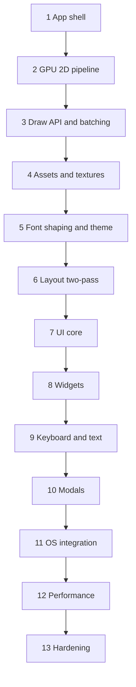

# Desktop UI and HUD plan — SDL3 + SDL_GPU + custom widgets

Build a **production HUD/desktop UI** on the existing hot-reload stack (`host/main.odin` + `game/` DLL).Each section below is **complete when its checkpoint passes** — later sections only add features; they do not redesign earlier APIs.

**Out of scope for this plan:** accessibility, packaging/installers.

**Reuse as-is:** `host/main.odin`, `build_hot_reload.sh`, hot-reload export procs, tracking allocator in the host, `WINDOW_HIGH_PIXEL_DENSITY`, performance counter timing.

---

## Target architecture (read once; all sections follow this)

### Package layout

Keep the `game` package name and `build/hot_reload/game.{so,dll,dylib}` output so the host and build script stay unchanged.

| File | Role |
|------|------|
| `game/app.odin` | `App_State`, window/GPU lifecycle, main loop, event pump, exported DLL procs |
| `game/gpu.odin` | GPU device helpers, pipeline creation, shader load |
| `game/render.odin` | Frame begin/end, swapchain, clear, present, dirty-region orchestration |
| `game/draw.odin` | Public draw API (`draw_rect`, `draw_texture`, `draw_text`, clip stack) |
| `game/batch.odin` | GPU vertex/index buffers, texture batch flush (internal to `draw`) |
| `game/texture.odin` | GPU texture upload, sampler, atlas slots |
| `game/font_shaper.odin` | FreeType face load + HarfBuzz shaping (glyph runs, clusters, direction) |
| `game/font.odin` | Glyph atlas upload, metrics, `measure_text` / `draw_text` via shaped runs |
| `game/assets.odin` | Path resolution, load cache, stable `Asset_Id` handles |
| `game/theme.odin` | Design tokens: colors, spacing, radii, typography |
| `game/layout.odin` | Pass-1 measure + flex/stack solve; writes `rect` on each tree node (not a widget) |
| `game/ui.odin` | UI frame: two-pass build, IDs, hit-test, focus, input consumption |
| `game/widgets.odin` | Panel, label, text, image, button, checkbox, slider, text field, select, dropdown, scroll view, list row |
| `game/input.odin` | Keyboard routing, tab order, shortcuts, text-editing state |
| `game/modal.odin` | Overlay stack: popups, tooltips, context menus, drag layer |
| `game/platform_os.odin` | Native file dialogs, system clipboard, drag-and-drop |
| `game/log.odin` | Structured error logging helpers |
| `game/shaders/ui.vert` | 2D ortho vertex shader (final) |
| `game/shaders/ui.frag` | Tinted textured quad fragment shader (final) |

### Core types (stable from Section 2 onward)

```odin
// Logical UI coordinates — always in "design pixels", not raw framebuffer pixels.
Vec2  :: [2]f32
Rect  :: struct { x, y, w, h: f32 }
Color :: struct { r, g, b, a: u8 }

Dpi_Info :: struct {
    scale:          f32, // drawable_w / logical_w
    logical_w, logical_h: i32,
    drawable_w, drawable_h: i32,
}

Asset_Id :: distinct i32
Texture_Handle :: struct { id: Asset_Id, w, h: f32 }
Font_Handle    :: struct { id: Asset_Id, size_px: f32 }

Theme :: struct {
    background, surface, border, text, text_muted: Color,
    accent, accent_hover, accent_pressed: Color,
    danger, success: Color,
    spacing_xs, spacing_sm, spacing_md, spacing_lg: f32,
    radius_sm, radius_md: f32,
    font_body, font_heading: Font_Handle,
}

UI_Id :: distinct u64
```

### Frame order (fixed for the whole project)

1. Poll SDL events → update `Input_State` and `Dpi_Info`
2. Run app `update(dt)` (your screens)
3. `ui_begin_frame()` — reset per-frame UI transient state
4. **Pass 1 — layout:** app calls widgets; each widget registers a tree node with layout config, intrinsic size is measured, solver writes final `rect` on every node
5. **Pass 2 — draw:** same widget procs run again (or a dedicated draw walk) using computed rects — emit draw commands, register hit targets
6. `ui_end_frame()` — resolve focus, modal hit layers
7. `render_frame()` — flush draw lists, present swapchain

### Hot reload rules

- GPU objects (`pipeline`, `textures`, `font atlas`) and font faces (`Font_Face` / HarfBuzz buffers) live in `App_State`; reload via `game_hot_reloaded` → `gpu_reload()` + `font_reload()` + rebind asset paths, same as today.
- UI widget code is plain procs; no static UI state outside `App_State`.
- `Asset_Id` and file paths survive reload; GPU handles are recreated in `assets_reload_gpu()`.


---

## Section 1 — App shell

**Goal:** Replace the game loop with a desktop app shell. Window, GPU claim, resize, focus, timing, and logging work; no gameplay, no 3D demo.

### Changes

| Action | Detail |
|--------|--------|
| Rename | `game/game.odin` → `game/app.odin` (update `build_hot_reload.sh` if it references the path — today it builds the `game` package dir, so only imports inside the package change) |
| Replace | `Game_Memory` → `App_State` with fields: `window`, `gpu`, `running`, `input`, `dpi`, `perf_*`, `force_reload/restart`, `theme` (empty until Section 5) |
| Simplify loop | Drop fixed-timestep gameplay; `app_update` = `poll_events` + `app_tick(dt)` + placeholder `render_clear_frame()` |
| Events | Keep: quit, resize, focus lost (clear keys/mouse), F5/F6 reload, F11 fullscreen. |
| `render.odin` | Clear swapchain to `theme.background` (hardcoded `{30,30,35,255}` until Section 5); no triangle draw |

### `Input_State` (final shape)

```odin
Input_State :: struct {
    mouse_x, mouse_y:     f32, // logical coords
    mouse_left, mouse_right, mouse_middle: bool,
    mouse_wheel_x, mouse_wheel_y: f32,
    keys_down:            [512]bool,
    text_input:           [dynamic]u8, // UTF-8 codepoints from SDL text events
    modifiers:            struct { shift, ctrl, alt, super: bool },
}
```

### Checkpoint

- [ ] `./build_hot_reload.sh` builds; host runs a resizable window with solid background
- [ ] Minimize / restore does not crash (nil swapchain path in render)
- [ ] F5 hot reload works; F6 restart resets `App_State` user fields
- [ ] `WINDOW_HIGH_PIXEL_DENSITY` + `WINDOW_PIXEL_SIZE_CHANGED` update `dpi` struct
- [ ] No references to player, platforms, or gamepad remain

---

## Section 2 — 2D GPU pipeline & coordinates

**Goal:** Final orthographic 2D rendering path. No perspective matrix, no rotating triangle. This pipeline is kept for all later drawing.

### Shaders

Replace `triangle.vert` / `triangle.frag` with `ui.vert` / `ui.frag`:

- **Vertex:** per-vertex `pos` (vec2), `uv` (vec2), `color` (vec4). Uniform `mat4 proj` maps logical top-left (0,0) → bottom-right (logical_w, logical_h) to NDC. Y-down logical space.
- **Fragment:** `texture2D` × vertex color tint; support untextured quads (white texture or push constant flag).

Update `build_hot_reload.sh` `build_shaders()` to compile `ui.vert` / `ui.frag` → `ui.spv.*`.

### `gpu.odin`

- `GPU_State`: `pipeline`, `sampler`, `white_texture` (1×1), `proj_mat`
- `gpu_update_projection(dpi: Dpi_Info)` — ortho `0..logical_w`, `0..logical_h`, depth -1..1
- `gpu_create_pipeline` — **triangle list**, blended alpha, single color target matching swapchain format
- Remove rotation, perspective, model matrix

### Coordinate helpers (`draw.odin` stub)

```odin
screen_to_logical :: proc(px_x, px_y: f32, dpi: Dpi_Info) -> Vec2
logical_to_screen :: proc(log_x, log_y: f32, dpi: Dpi_Info) -> Vec2
rect_contains      :: proc(r: Rect, p: Vec2) -> bool
```

Mouse events in `poll_events` convert raw window coords → logical via `dpi.scale`.

### Checkpoint

- [ ] Colored fullscreen quad fills the window in logical space (letterbox/pillarbox if you choose aspect lock — default: stretch to window logical size)
- [ ] Resizing updates projection; no stretching artifacts on non-square windows
- [ ] `gpu_reload()` recreates pipeline after F5 without leak warnings from tracking allocator

---

## Section 3 — Draw API & GPU batching

**Goal:** Production draw layer. Public API is final; batching is an internal implementation detail.

### `draw.odin` — public API

```odin
draw_begin :: proc(cmd: ^sdl.GPUCommandBuffer, pass: ^sdl.GPURenderPass, dpi: Dpi_Info)
draw_end   :: proc()

draw_push_clip :: proc(r: Rect)
draw_pop_clip  :: proc()

draw_rect      :: proc(r: Rect, color: Color, radius: f32 = 0) // radius 0 = sharp; >0 uses corner mask in shader or precomputed mesh
draw_rect_outline :: proc(r: Rect, color: Color, thickness: f32)
draw_line      :: proc(a, b: Vec2, color: Color, thickness: f32)
draw_texture   :: proc(tex: Texture_Handle, src, dst: Rect, tint: Color = {255,255,255,255})
draw_text      :: proc(font: Font_Handle, text: string, pos: Vec2, color: Color, max_w: f32 = 0) // stub returns size; implemented Section 4
```

### `batch.odin`

- Persistent GPU vertex buffer (grow-only, e.g. start 64 Ki vertices)
- Batch key: `{texture_id, clip_hash}` — flush on clip change or texture change
- Each quad: 4 verts, 6 indices; interleaved `{pos, uv, color}`
- Scissor rect = intersection of clip stack top and drawable area, in **framebuffer pixels**
- `draw_end` flushes remaining batch

### `render.odin`

```odin
render_frame :: proc(clear: Color) {
    // acquire swapchain → begin pass → draw_begin → app/ui draws → draw_end → present
}
```

### Checkpoint

- [ ] 10,000 `draw_rect` calls at 60 FPS on a 1080p window (batching, not 10k draw calls)
- [ ] Clip stack: nested clips correctly scissor children
- [ ] `draw_texture` works with `white_texture` and a loaded 256×256 test image
- [ ] API signatures above are unchanged in all following sections

---

## Section 4 — Assets & GPU textures

**Goal:** Load images once, reference by stable `Asset_Id` across hot reloads.

### `assets.odin`

```odin
assets_init     :: proc(gpu: ^sdl.GPUDevice)
assets_shutdown :: proc()
assets_reload_gpu :: proc(gpu: ^sdl.GPUDevice) // after hot reload

assets_load_texture :: proc(path: string) -> (Texture_Handle, bool)
assets_get_texture  :: proc(id: Asset_Id) -> Texture_Handle
```

- Resolve paths relative to executable working directory (host already `chdir` to exe dir)
- `SDL_LoadSurface` → upload to `SDL_CreateGPUTexture` (not `SDL_Renderer`)
- Cache: path string → `Asset_Id`; on reload, destroy old GPU textures and re-upload from cached surfaces or re-read files
- Support PNG via existing `vendor:sdl3/image` if needed, or SDL surface loaders

### `texture.odin`

- Owns GPU texture objects, sizes, format
- Optional **texture atlas** (single atlas texture + `Atlas_Region` table) for UI icons baked at build time or runtime pack — implement atlas allocator (shelf or simple bin pack) now; widgets use sub-rects from day one

### Remove

- All `^sdl.Renderer` and `^sdl.Texture` usage from old `texture.odin`

### Checkpoint

- [ ] Load `assets/ui/icons.png` (or any test sheet); draw multiple sub-rects via atlas regions
- [ ] Hot reload does not leak textures (tracking allocator clean)
- [ ] Missing file logs via `log.odin` and returns false without crashing

---

## Section 5 — Font shaping, text & theme

**Goal:** Production text from day one: FreeType rasterization, HarfBuzz shaping, GPU glyph atlas, and a consistent visual language. Widgets in Section 8 only read from `Theme`; all text paths go through the shaper — no SDL_ttf, no per-codepoint shortcuts.

### Dependencies

Link **FreeType** and **HarfBuzz** in `build_hot_reload.sh` (system libs or vendored). Odin bindings: `vendor:freetype` / `vendor:harfbuzz` if available in your Odin tree; otherwise thin `foreign` bindings in `game/font_shaper.odin`.

### `font_shaper.odin` — FreeType + HarfBuzz (required)

```odin
Text_Direction :: enum { LTR, RTL }

Shaped_Glyph :: struct {
    glyph_id:   u32,
    cluster:    u32,   // UTF-8 byte offset in source string
    x_offset, y_offset: f32,
    x_advance, y_advance: f32,
}

Shaped_Line :: struct {
    glyphs:     []Shaped_Glyph,
    width:      f32,
    direction:  Text_Direction,
}

Font_Face :: struct {
    ft_face:    rawptr, // FT_Face
    hb_font:    rawptr, // hb_font_t*
    size_px:    f32,
    ascent, descent, line_height: f32,
}

font_load_face   :: proc(path: string, size_px: f32) -> (Font_Face, bool)
font_destroy_face :: proc(face: ^Font_Face)
font_reload_faces :: proc() // after hot reload: destroy and reload all faces from cached paths

font_shape       :: proc(face: ^Font_Face, text: string, direction: Text_Direction) -> []Shaped_Glyph
font_shape_line  :: proc(face: ^Font_Face, text: string, max_w: f32, direction: Text_Direction) -> []Shaped_Line
```

Implementation requirements:

- **FreeType:** load `.ttf`/`.otf`; set char size in points scaled by `dpi.scale`; `FT_Load_Glyph` + `FT_Render_Glyph` (or SDF later — bitmap is fine for this section)
- **HarfBuzz:** `hb_ft_font_create`, `hb_buffer_add_utf8`, set direction/script/language, `hb_shape`, read glyph positions/advances/clusters
- **Clusters:** preserve for caret placement and selection in Section 9 (map click offset → byte index via cluster array)
- **Direction:** explicit `Text_Direction` per widget; default LTR; RTL paragraphs shaped with `HB_DIRECTION_RTL`
- **Font stack:** body 16px + heading 20px as two `Font_Face` instances in `App_State`

### `font.odin` — atlas & draw

- **Glyph atlas** texture: dynamic upload per `glyph_id` on first use; shelf/bin pack in atlas (same allocator as Section 4 texture atlas)
- `font_ensure_glyphs(face, glyphs: []Shaped_Glyph)` — rasterize missing glyphs into atlas before draw
- `font_measure(face, text, max_w, direction) -> Vec2` — uses `font_shape_line` for wrap width/height
- `draw_text` — iterate shaped lines/glyphs, emit `draw_texture` quads from atlas regions; vertex color × tint
- Line breaking: break on `max_w` using shaped advances; respect HarfBuzz cluster boundaries (no mid-grapheme breaks)

### `theme.odin`

```odin
theme_default :: proc(assets: ^Asset_Cache) -> Theme
theme_color   :: proc(t: ^Theme, role: Theme_Color_Role) -> Color
```

- Provide `theme_dark()` and `theme_light()` presets
- Store active theme in `App_State.theme`
- All hardcoded colors from earlier sections removed

### Checkpoint

- [ ] `draw_text` renders multi-line wrapped Latin text in a clipped rect
- [ ] Arabic sample string (`مرحبا`) shapes RTL and aligns to the right when `direction = .RTL`
- [ ] Mixed EN+AR paragraph selects correct direction per run (or explicit paragraph direction) without tofu boxes
- [ ] CJK sample (`日本語`) shapes and wraps without mid-glyph cluster splits
- [ ] `font_measure` and drawn output agree within 1 logical px
- [ ] Resizing window does not blur text (atlas pixel-aligned; snap draw positions to 0.5 logical px)
- [ ] Switching `theme_light` / `theme_dark` at runtime recolors a demo screen without code changes in draw calls
- [ ] Hot reload recreates FreeType/HarfBuzz faces and GPU atlas without leaks

---

## Section 6 — Layout (CSS-style, two-pass)

**Goal:** Flex/stack layout like HTML/CSS — layout properties live on each widget, not in a separate layout widget. App code never manually stacks `y += height`. Every frame: **pass 1** builds a tree and computes rects; **pass 2** draws from those rects.

### Layout on every widget (HTML/CSS model)

There is no `ui_layout()` container and no separate “layout-only” widget type. **Every widget** — panel, label, button, text field — carries the same layout fields on its declaration:

```odin
Widget_Style :: struct {
    // sizing (participates in parent flex like any HTML element)
    width, height:  Width,   // fixed px, %, grow, hug
    min_w, max_w, min_h, max_h: f32,
    flex:           f32,      // flex-grow within parent stack
    aspect_ratio:   f32,

    // box model — applies whether or not the widget has children
    padding:        Padding,
    gap:            Gap,      // space between children
    direction:      Direction, // .Horizontal | .Vertical stack
    justify:        Justify,   // main + cross axis alignment

    // ... theme, border, clip, etc.
}
```

- **Any widget can have children.** Like HTML: a `<button>` holds an icon + label; a search `<input>` holds a leading icon and trailing clear button; a `<div>` holds rows. Same here — `ui_text_field`, `ui_button`, and `ui_panel` all accept an optional `body: proc()` for child widgets.
- **Any widget can be a flex child.** A text field inside a horizontal toolbar uses `flex = 1` the same way a panel would; no special-case sizing API.
- **Intrinsic vs container measure:** if a widget has no children, pass 1 uses widget-specific intrinsic measure (label → `font_measure`, image → texture size). If it has children (or a built-in child slot), pass 1 runs `layout_measure` over the child subtree like any other flex container. Widget behavior (click, keyboard, caret) is separate from layout role.
- **Grid:** defer to a single `ui_grid(cols, rows, cell_w, cell_h)` helper built on nested stacks if needed; no second layout system later.

### Pass 1 — measure + solve (`layout.odin`)

Build a transient tree each frame (temp allocator). Each widget call pushes a node; children are nodes appended under the current parent.

```odin
Layout_Node :: struct {
    config:   Widget_Style,  // resolved declaration for this instance
    desired:  Vec2,           // intrinsic size from widget measure
    rect:     Rect,           // written by solver
    children: []Layout_Node,
}

layout_push_node :: proc(config: Widget_Style) -> ^Layout_Node
layout_pop_node  :: proc()
layout_measure   :: proc(node: ^Layout_Node) -> Vec2  // bottom-up intrinsic size
layout_solve     :: proc(root: ^Layout_Node, bounds: Rect)
```

Pass-1 flow per widget proc:

1. Resolve dynamic config (`padding`, `direction`, etc. from theme/state callbacks)
2. `layout_push_node(config)`
3. Recurse into child widget procs (they push their own nodes)
4. `layout_pop_node()` — on pop, measure this node: children present → `layout_measure` over subtree; no children → widget intrinsic measure (text → `font_measure`, image → texture size, text field default chrome → min size + padding)
5. After the root subtree returns, `layout_solve(root, parent_bounds)` assigns final `rect` to every node

Solver supports: horizontal/vertical stack, flex grow/shrink, padding, gap, min/max clamps, cross-axis align (start/center/end/stretch).

### Pass 2 — draw (`ui.odin` + widgets)

After pass 1, every node has a final `rect`. Pass 2 re-enters widget procs in draw mode:

```odin
ui_layout_rect :: proc(id: UI_Id) -> Rect  // rect from pass-1 node for this id
```

- Widgets read `ui_layout_rect(id)` instead of computing x/y themselves
- Emit `draw_*` calls clipped to node rect; register hit targets at node rect
- Input/hover uses pass-2 rects; no layout work during draw
- single-pass render

`ui_begin_frame()` resets the tree and sets pass to `.Layout`. A single `ui_end_layout_pass()` (or implicit boundary before draw) runs `layout_solve` on the root, then switches to pass `.Draw`.

### Integration sketch

All widgets share the same layout/draw split. Container-style (panel) and composite-style (text field with adornments) use the same pattern:

```odin
ui_widget :: proc(config: Widget_Style, body: proc() = nil) {
    id := ui_id(config.id)
    if ui_pass() == .Layout {
        layout_push_node(resolve_config(config))
        if body != nil do body() // optional children — icon, label, etc.
        layout_pop_node()
        return
    }
    rect := ui_layout_rect(id)
    draw_widget_chrome(rect, config) // border, background, focus ring
    ui_push_clip(content_rect(rect, config.padding))
    if body != nil do body()
    else draw_widget_default_content(rect, config) // e.g. bare label text
    ui_pop_clip()
}
```

App code stays flat — only widget calls, no manual layout math:

```odin
ui_panel({ direction = .Horizontal, height = 48 }, proc() {
    ui_panel({ width = 240 }, proc() { /* sidebar */ })
    ui_text_field({ flex = 1, direction = .Horizontal, gap = 8 }, proc() {
        ui_image({ width = 16, height = 16 }, search_icon)
        // editable area fills remaining flex via default child slot or inner flex child
    })
})
```

### Checkpoint

- [ ] Pass 1 builds a tree; pass 2 draws from stored rects — no widget reads mouse position during layout
- [ ] Toolbar (fixed height) + sidebar (fixed width) + content (`flex = 1`) fills the window on resize without manual position math
- [ ] `min_w` / `max_w` on a text field clamp correctly inside a narrow panel
- [ ] Text field with `flex = 1` and horizontal `direction` lays out icon + editable area like an HTML input group
- [ ] Padding and gap on any widget (panel, button, text field) affect child rects consistently
- [ ] Layout results are deterministic and stable frame-to-frame

---

## Section 7 — UI core

**Goal:** Immediate-mode UI foundation: pass coordination (Section 6), IDs, hit testing, focus, input consumption. Widgets are thin wrappers over this.

### `ui.odin`

```odin
UI_Pass :: enum { Layout, Draw }

ui_begin_frame      :: proc()
ui_end_layout_pass  :: proc() // runs layout_solve, switches to .Draw
ui_end_frame        :: proc()

ui_pass             :: proc() -> UI_Pass
ui_layout_rect      :: proc(id: UI_Id) -> Rect // pass-1 result; valid in .Draw

ui_id               :: proc(label: string) -> UI_Id  // hash of label + parent scope
ui_rect             :: proc(id: UI_Id, r: Rect) -> bool // registers hit target (draw pass only)

ui_is_hovered       :: proc(id: UI_Id) -> bool
ui_is_active        :: proc(id: UI_Id) -> bool // mouse down on widget
ui_is_focused       :: proc(id: UI_Id) -> bool

ui_want_capture_mouse    :: proc() -> bool
ui_want_capture_keyboard :: proc() -> bool
```

- **Two-pass build:** app calls the same widget tree twice per frame — layout pass registers nodes and measures; `ui_end_layout_pass()` solves; draw pass reads `ui_layout_rect` and emits geometry + hit targets
- **Hit test:** front-to-back = reverse declaration order within draw pass; modal layer (Section 10) inserts at top
- **Focus:** one `focused_id`; click sets focus; tab moves focus (Section 9)
- **Input consumption:** if `ui_want_capture_mouse`, app does not receive clicks; events handled in `poll_events` by calling `ui_handle_event(event)`

### Scope stack

`ui_push_clip(r)` / `ui_pop_clip()` — clip children during pass 2; layout bounds come from pass-1 solved rects, not a separate parent-rect stack

### Checkpoint

- [ ] Three overlapping buttons; topmost receives hover/click
- [ ] Clicking a button sets focus ring; clicking empty clears focus
- [ ] Mouse wheel over scrollable region flag consumed (stub scroll view until Section 8)

---

## Section 8 — Widget library

**Goal:** Complete widget set for desktop apps and tools. Each widget owns layout config on its declaration (pass 1) and draw/hit-test (pass 2) — `Theme` + `draw` only; no ad-hoc SDL calls.

### `widgets.odin`

| Widget | Behavior |
|--------|----------|
| `ui_panel` | Background + optional border + clip; optional `body` for children |
| `ui_label` | Single-line text, ellipsis overflow; optional `body` (icon + text row) |
| `ui_text` | Multi-line read-only, wrap |
| `ui_image` | Fit / fill / stretch modes |
| `ui_button` | Normal / hover / pressed / disabled; `on_click` id; optional `body` (icon, label, badge) |
| `ui_checkbox` | Toggle bool ref; optional `body` (box + label row) |
| `ui_slider` | Drag axis → scalar ref in range |
| `ui_text_field` | Caret, selection, editable string ref (Section 9); optional `body` (prefix icon, suffix clear, etc.) — `flex`/`direction`/`gap` layout like HTML |
| `ui_select` | Listbox, visible rows, single selection index |
| `ui_dropdown` | Closed row + popup list (uses modal layer) |
| `ui_scroll_view` | Clip + content offset + wheel scroll + optional scrollbar |
| `ui_list_row` | Selectable row for lists / asset browser |

Every widget accepts the same `Widget_Style` layout fields (`flex`, `padding`, `direction`, …). Composite widgets without a `body` draw their default content (e.g. plain label string); with a `body`, children are laid out via the shared flex solver from Section 6.

### States

```odin
Widget_Flags :: bit_set[Widget_Flag; i32]
Widget_Flag :: enum { Disabled, Hidden }
```

Disabled widgets skip hit test; drawn muted via theme.

### Demo screen

Build a **Settings** panel in `app_tick`: sidebar nav + content area with label, slider, checkbox, dropdown, text field — proves all widgets.

### Checkpoint

- [ ] Settings demo mutates live `App_State` values (volume, username, theme toggle)
- [ ] Dropdown popup draws above siblings and clips to screen edges
- [ ] Scroll view scrolls 200 list rows with scrollbar thumb
- [ ] No widget proc reaches into GPU or SDL directly

---

## Section 9 — Keyboard, shortcuts & text editing

**Goal:** Desktop-grade input without revisiting widget code.

### `input.odin`

**Tab order:** declaration order within focused panel; Shift+Tab reverse. `ui_focus_next()` / `ui_focus_prev()`.

**Shortcuts:** register `Shortcut { keys, ctrl, shift, alt, callback }` table; evaluated before text input when focus allows.

**Text field editing:**
- SDL text input events (`SDL_StartTextInput` / `Stop` when field focused)
- Arrow keys, Home/End, Ctrl+A/C/V/X (clipboard via Section 11)
- Selection range `{start, end}` in **UTF-8 byte offsets** aligned to HarfBuzz clusters from `font_shaper.odin` (no splitting inside a cluster)
- Delete/backspace remove whole clusters when grapheme would break
- Caret blink timer in `App_State`; caret x-position from shaped glyph advances, not per-codeunit guess

**Global vs focused:** shortcuts with `global = true` fire even when a text field is focused only if explicitly registered (e.g. Ctrl+S save).

### Checkpoint

- [ ] Tab cycles through all focusable widgets in Settings demo
- [ ] Text field: select all, copy, paste, undo stack (single-level undo is enough)
- [ ] Caret and selection in RTL and Latin text use cluster boundaries from `font_shaper.odin`
- [ ] Ctrl+S triggers a stub save callback without inserting `s` into the field

---

## Section 10 — Modal & overlay layer

**Goal:** Z-ordered overlays that work with the same UI core.

### `modal.odin`

```odin
ui_open_popup   :: proc(anchor: Rect, body: proc())
ui_tooltip      :: proc(text: string, anchor: Rect)
ui_context_menu :: proc(items: []Context_Item, pos: Vec2)
ui_drag_overlay :: proc(preview: proc()) // semi-transparent drag ghost
```

- Popup layer drawn last; separate hit pass before `ui_end_frame`
- Click outside popup closes it (configurable)
- Tooltip delay 400 ms; only one tooltip active
- Context menu: keyboard arrows + Enter; Escape closes

### Checkpoint

- [ ] Dropdown from Section 8 uses `ui_open_popup` internally (no duplicate popup system)
- [ ] Right-click context menu on list row
- [ ] Drag slider thumb shows `ui_drag_overlay` ghost on top of everything

---

## Section 11 — Native OS integration

**Goal:** Behaviors users expect from desktop apps.

### `platform_os.odin`

| Feature | Implementation |
|---------|----------------|
| **System clipboard** | SDL clipboard API for UTF-8 text; bridge to `input.odin` paste/copy |
| **File open/save** | SDL3 file dialog (`SDL_ShowOpenFileDialog` / save variant) async callback → store result path in `App_State` |
| **Folder pick** | Same dialog API with folder flag |
| **Drag and drop** | `SDL_EVENT_DROP_FILE` → emit `ui_file_dropped(path)` to focused widget or app handler |
| **Window state** | Persist size/position/maximized to `settings.ini` on quit; restore on launch |
| **Multi-monitor** | On `SDL_EVENT_WINDOW_DISPLAY_CHANGED`, update `dpi` and re-center optional dialogs |

Use simple INI or JSON for window prefs only (not full app packaging).

### Checkpoint

- [ ] Open INI/settings file dialog loads path into text field
- [ ] Drag image file onto window loads preview in `ui_image`
- [ ] Copy/paste works between app and external text editor
- [ ] Restart app restores window geometry

---

## Section 12 — Performance

**Goal:** Stay fast with large UIs; no redraw architecture changes later.

### Dirty regions

```odin
Render_Dirty :: struct {
    full_frame: bool,
    rects:      [dynamic]Rect, // logical space
}
```

- `ui_invalidate(rect)` marks dirty; root layout change → `full_frame`
- `render_frame` clears only dirty rects when `!full_frame` (scissor per rect, or full clear if >50% area dirty)
- Widgets call `ui_invalidate` on state change only

### Virtualized lists

`ui_list_virtualized(count, row_h, proc(i: int, row_rect: Rect))` — only build rows intersecting scroll clip. Used by `ui_select` and asset lists internally.

### Frame stats

- Rolling FPS and `draw_call_count` / `batch_flush_count` in debug overlay (toggle F3)
- Log frame spikes > 33 ms

### Checkpoint

- [ ] 10k-row virtual list scrolls at 60 FPS
- [ ] Dirty rect mode reduces GPU clear cost when only a caret blinks in one text field
- [ ] F3 overlay shows batch stats without stuttering

---

## Section 13 — Production hardening

**Goal:** Ship-quality diagnostics and failure modes.

### `log.odin`

- `log_error`, `log_warn` wrapping `core:log` with file/line
- GPU/SDL failures log and set `App_State.last_error: string` for on-screen banner via `ui_label`

### Error UX

- Non-fatal: toast panel (auto-dismiss 3 s) via modal layer
- Fatal GPU device loss: message box + graceful quit

### RenderDoc

- Document: capture via environment or swapchain debug name; pipeline `debug_name = "ui_pipeline"`

### Asset failures

- Pink/black checker `Texture_Handle` for missing images; widgets still layout

### Final app demo

Replace Settings-only demo with a small **Document browser** app:
- Menu bar (File Open, Save, Quit) with shortcuts
- Sidebar virtualized file list
- Main text area (`ui_text` read-only or `ui_text_field` editable)
- Status bar: line/col, FPS, last error
- Proves every subsystem together

### Checkpoint

- [ ] Deliberately missing texture shows fallback, logs once, no crash
- [ ] GPU pipeline creation failure shows error banner and exits cleanly
- [ ] Document browser survives F5 hot reload with document text preserved in `App_State`
- [ ] Tracking allocator reports zero leaks on quit

---

## Build & assets checklist

### `build_hot_reload.sh` updates

- Compile `game/shaders/ui.vert` and `ui.frag` (keep old triangle rules removed)
- Optional: copy `assets/` next to `build/hot_reload/` output on build

### `assets/` layout

```
assets/
  fonts/
    Inter-Regular.ttf       # Latin body
    NotoSansArabic-Regular.ttf
    NotoSansJP-Regular.otf
  ui/
    icons.png          # atlas sheet
  textures/
    fallback.png       # checker
```

### Dependencies

- Vulkan SDK (`glslc`) — already required
- SDL3 with GPU enabled — already required
- **FreeType** — link in `build_hot_reload.sh` from Section 5 onward (`-lfreetype` or platform equivalent)
- **HarfBuzz** — link alongside FreeType (`-lharfbuzz`); HarfBuzz must be built with FreeType support

---

## Section dependency graph



Sections are sequential; do not skip. Each checkpoint gates the next.

---

## What this plan deliberately excludes

| Topic | Reason |
|-------|--------|
| Accessibility | Out of scope per project request |
| Packaging / installers / code signing | Out of scope per project request |
| Game collision, camera, entities | Not desktop UI |
| Dear ImGui / third-party GUI | Custom stack only |
| SDL_ttf | Replaced by FreeType + HarfBuzz in Section 5 |
| SVG / vector paths | Optional future module behind `draw_path`; not required for standard widgets |
| Audio | Not required for desktop UI |
