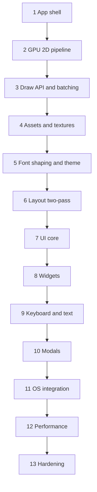

# APP UI and HUD plan — SDL3 + SDL_GPU + custom widgets

Build a **production HUD/APP UI** on the hot-reload stack (`main.odin` host + `app/` DLL). Each checkbox tracks codebase reality: `[x]` **done**, `[ ]` **not done**. Later sections add features; they do not redesign earlier APIs.

**Out of scope for this plan:** accessibility (phase 2), packaging/installers, SVG/`draw_path`, audio.

**Reuse as-is:** `main.odin`, `build_hot_reload.sh`, hot-reload export procs (`app/exports.odin`), tracking allocator in the host, `WINDOW_HIGH_PIXEL_DENSITY`, performance counter timing.

---

## Target architecture (synced with codebase)


### Package layout


| Path                  | Role                                                                  | Status |
| --------------------- | --------------------------------------------------------------------- | ------ |
| `main.odin`           | Hot-reload host; loads `build/hot_reload/app.so`                      | [x]    |
| `oni/`                | Engine: GPU, layout, draw, fonts, UI frame, lifecycle                 | [x]    |
| `oni/widgets/`        | Built-in widgets (`Button`, `Text`, `Rectangle`, `Image`, `Table`, …) | [x]    |
| `oni/set/`            | Style helpers that wrap values in `Cfg(T)`                            | [x]    |
| `oni/api.odin`        | Public PascalCase aliases for the engine API                          | [x]    |
| `oni/templates/`      | Starter app/theme templates                                           | [x]    |
| `app/`                | Demo app: routes, components, theme, exported DLL entry points        | [x]    |
| `tengu/`              | Standalone animation library (no Oni dependency)                      | [x]    |
| `assets/`             | Runtime assets (fonts, textures)                                      | [x]    |
| `build_hot_reload.sh` | Build, run, watch, stop                                               | [x]    |


### Engine modules


| File                                              | Role                                                                   | Status |
| ------------------------------------------------- | ---------------------------------------------------------------------- | ------ |
| `oni/engine.odin` / `runtime.odin` / `state.odin` | Window/GPU lifecycle, main loop, event pump                            | [x]    |
| `oni/gpu.odin`                                    | GPU device helpers, pipeline creation, shader load                     | [x]    |
| `oni/present.odin`                                | Frame begin/end, swapchain, clear, present                             | [x]    |
| `oni/draw.odin`                                   | Public draw API (`draw_rect`, `draw_texture`, `draw_line`, clip stack) | [x]    |
| `oni/batch.odin`                                  | GPU vertex/index buffers, texture batch flush                          | [x]    |
| `oni/texture.odin`                                | GPU texture upload, sampler, shelf atlas                               | [x]    |
| `oni/font_shaper.odin`                            | Font family registry, VF/static matching, FreeType + HarfBuzz          | [x]    |
| `oni/font.odin`                                   | Glyph atlas, resolve instances, synthetic bold/italic, text draw       | [x]    |
| `oni/assets.odin`                                 | Path resolution, load cache, stable `Asset_Id` handles                 | [x]    |
| `app/theme.odin`                                  | App theme build (Inter body/heading); palette lives in engine          | [x]    |
| `oni/layout.odin`                                 | Pass-1 measure + flex/stack solve; writes `rect` on each node          | [x]    |
| `oni/ui.odin`                                     | UI frame: two-pass build, IDs, focus, tab order                        | [x]    |
| `oni/widgets/*.odin`                              | Button, Text, Rectangle, Image, Table (+ parts)                        | [x]    |
| `oni/log.odin`                                    | Structured error/warn/debug logging helpers                            | [x]    |
| `oni/shaders/ui.vert` / `ui.frag`                 | 2D ortho + tinted textured quad                                        | [x]    |
| `oni/input.odin` (shortcuts + text-editing state) | Dedicated input module beyond tab/focus                                | [ ]    |
| `oni/modal.odin`                                  | Modal UX widgets (stacking slot: `space = .POPOVER` / `Popover_Begin`) | [ ]    |
| `oni/platform_os.odin`                            | Native file dialogs, system clipboard, drag-and-drop                   | [ ]    |


### Core types (stable)

Logical UI coordinates — always in design pixels, not raw framebuffer pixels. Engine uses `RGBA`, richer `Theme` (palette + CSS-like layout defaults), and layout/widget IDs as implemented in `oni/types.odin`.

```odin
Vec2  :: [2]f32
Rect  :: struct { x, y, w, h: f32 }
Dpi_Info :: struct {
	scale: f32,
	logical_w, logical_h: i32,
	drawable_w, drawable_h: i32,
}
Asset_Id :: distinct i32
Font_Handle / Font_Face_Handle / Font_Style / Font_Weight
UI_Id :: distinct u64
```

- [x] Logical coords + `Dpi_Info`
- [x] `Asset_Id` / texture + font handles
- [x] Theme with palette, fonts, layout defaults (richer than original flat token sketch)
- [ ] Flat `theme_light` / `theme_dark` preset procs as originally sketched


### Frame order (fixed)

1. Poll SDL events → update input + `Dpi_Info`
2. App tick / screens
3. `ui_begin_frame()` — reset per-frame UI transient state
4. **Pass 1 — layout:** widgets register tree nodes; solver writes `rect`
5. **Pass 2 — draw:** same widget procs; `ui_layout_rect`; emit draw + handle input
6. `ui_end_frame()` — focus / tab bookkeeping (popover paint/hit via `space = .POPOVER` / `Popover_Begin`)
7. `present_frame()` — flush draw lists, present swapchain

App entry: prefer `o.Render(main_ui)` (`oni/ui.odin` / `oni/api.odin`).

### Hot reload rules

- [x] GPU objects, font families/faces, atlas live in engine state; rebound on reload
- [x] App long-lived UI state in heap `Persistent` (`app/exports.odin`); host keeps pointer across DLL swaps
- [x] `Asset_Id` + paths survive reload; GPU handles recreated via assets/texture reload
- [x] Widget code is plain procs; no long-lived UI state in package globals outside `Persistent` / engine state

---


## Section 1 — App shell

**Goal:** App shell. Window, GPU claim, resize, focus, timing, logging; no gameplay / 3D demo.

### Deliverables

- [x] Hot-reload host + `app` DLL (`build/hot_reload/app.so`)
- [x] Engine state: window, GPU, running, input, dpi, perf timing, force reload/restart
- [x] Loop: poll events + tick + clear/present (no fixed-timestep gameplay)
- [x] Events: quit, resize, focus lost (clear keys/mouse), F5 reload, F6 restart, F11 fullscreen
- [x] Clear swapchain from theme background
- [x] `Input_State`: mouse (logical), buttons, wheel, keys, text_input buffer, modifiers


### Checkpoint

- [x] `./build_hot_reload.sh` builds; host runs a resizable window with solid background
- [x] Minimize / restore does not crash (nil swapchain / zero drawable path)
- [x] F5 hot reload works; F6 restart resets app user fields via host lifecycle
- [x] `WINDOW_HIGH_PIXEL_DENSITY` + pixel/display-scale events update `dpi`

---


## Section 2 — 2D GPU pipeline & coordinates

**Goal:** Orthographic 2D rendering path kept for all later drawing.

### Deliverables

- [x] `oni/shaders/ui.vert` / `ui.frag` (replace triangle demo shaders)
- [x] Build compiles UI shaders to SPIR-V
- [x] `GPU_State`: pipeline, sampler, white 1×1 texture, projection
- [x] Ortho `0..logical_w`, `0..logical_h`, Y-down logical space
- [x] Triangle list, blended alpha, swapchain color target
- [x] `screen_to_logical` / `logical_to_screen` / `rect_contains`
- [x] Mouse events converted to logical via `dpi.scale`
- [x] Artboard / screen draw spaces (`Begin_Artboard` / `Begin_Screen`) beyond original stub


### Checkpoint

- [x] Colored fullscreen clear / quads fill the window in logical space
- [x] Resizing updates projection
- [x] `gpu_reload()` recreates pipeline after F5

---


## Section 3 — Draw API & GPU batching

**Goal:** Production draw layer. Public API stable; batching internal.

### Public API

- [x] `draw_begin` / `draw_end` (+ record/flush split used by present)
- [x] `draw_push_clip` / `draw_pop_clip`
- [x] `draw_rect` with corner radii (+ border support)
- [x] `draw_line`
- [x] `draw_texture` (+ fitted / atlas helpers)


### Batching / present

- [x] Persistent grow-only GPU vertex/index buffers
- [x] Batch key by texture + clip; flush on change
- [x] Quads: 4 verts / 6 indices; interleaved pos/uv/color (+ rounded modes)
- [x] Scissor in framebuffer pixels from clip stack
- [x] `present_frame` acquires swapchain → pass → flush → present


### Checkpoint

- [ ] Proven 10,000 `draw_rect` calls at 60 FPS (batching exists; no benchmark demo)
- [x] Nested clips correctly scissor children
- [x] `draw_texture` works with white texture and loaded images
- [x] Core draw signatures stable for later sections (extended, not replaced)

---


## Section 4 — Assets & GPU textures

**Goal:** Load images once; stable `Asset_Id` across hot reloads.

### Deliverables

- [x] `assets_init` / `assets_shutdown` / reload-after-hot-reload path
- [x] `assets_load_texture` / `assets_get_texture` (`Load_Texture` / `Get_Texture`)
- [x] Paths relative to exe working directory
- [x] Surface load → `SDL_CreateGPUTexture` (no `SDL_Renderer`)
- [x] Path → `Asset_Id` cache; GPU re-upload on reload
- [x] Shelf atlas allocator in `texture.odin` (glyphs + pack helpers)
- [ ] Ship `assets/ui/icons.png` UI icon atlas sheet
- [ ] Missing-image checker / pink-black fallback texture handle for widgets


### Checkpoint

- [ ] Load icon sheet; draw multiple sub-rects via atlas regions
- [x] Hot reload texture path exists (allocator cleanliness assumed via host tracking)
- [x] Missing file logs via `log.odin` and returns false without crashing

---


## Section 5 — Font shaping, text & theme

**Goal:** Font families, FreeType rasterization, HarfBuzz shaping, glyph atlas, weight/style/decoration, theme-driven text.

### Dependencies

- [x] FreeType + HarfBuzz linked in `build_hot_reload.sh`
- [x] Thin bindings: `oni/freetype.odin`, `oni/harfbuzz.odin`


### Public font API

- [x] `Register_Font_Family` / `Font_With_Size` / `font_resolve`
- [x] Theme registers Inter; body 16px + heading 20px
- [x] VF `wght` / `opsz`; static face weight matching
- [x] Synthetic bold / italic when faces missing
- [x] Style surface: font, size, weight, style, decoration lines/style/color, text direction
- [x] Glyph atlas + `font_ensure_glyphs` / layout-owned wrap + draw
- [x] Decoration: underline / line-through / overline × solid/double/dotted/dashed/wavy
- [x] Wrap modes + letter-spacing; HarfBuzz clusters
- [x] Explicit `Text_Direction` (LTR/RTL)
- [ ] `theme_light()` / `theme_dark()` presets + runtime switch demo
- [ ] Optional Noto Arabic / CJK fallback families in `fixtures/fonts/`
- [ ] Demo routes proving Arabic RTL, mixed EN+AR, and CJK wrap samples


### Checkpoint

- [x] Layout-owned multi-line wrapped Latin text in clipped rects
- [x] `font_weight` / `font_style` select VF axes or static faces; missing faces synthesize
- [x] Decorations draw for underline / line-through / overline in all five styles
- [ ] Arabic sample shapes RTL when `direction = .RTL` (API ready; no demo font/route)
- [ ] Mixed EN+AR paragraph without tofu (needs fallback fonts + demo)
- [ ] CJK sample shapes/wraps without mid-glyph splits (needs font + demo)
- [x] Measure/draw path shared via layout-owned text
- [x] DPI-aware rasterization / artboard zoom path for sharp text
- [ ] Switching light/dark theme at runtime without draw-call code changes
- [x] Hot reload re-registers families and recreates GPU atlas path

---


## Section 6 — Layout (CSS-style, two-pass)

**Goal:** Flex/stack layout on every widget. Pass 1 measures/solves; pass 2 draws from rects.

### Deliverables

- [x] No separate layout-only widget; layout fields on widget config
- [x] Any widget can take children (`child` / `Children`)
- [x] Flex child sizing (`flex`, fixed, %, hug), padding, gap, direction, justify
- [x] `min_w` / `max_w` / `min_h` / `max_h` clamps
- [ ] `aspect_ratio` style field
- [ ] `ui_grid(cols, rows, …)` helper (nested stacks OK for now)
- [x] `layout_push` / measure / `layout_solve` tree
- [x] Pass 2: `ui_layout_rect(id)`; no layout solve during draw
- [x] `o.Render` runs layout then draw
- [x] Table layout (beyond original plan): caption/head/body/foot/row/cell


### Checkpoint

- [x] Pass 1 builds tree; pass 2 draws from stored rects
- [x] Nav + sidebar + content shell works without manual `y += height` math
- [x] `min_w` / `max_w` clamping supported by solver
- [ ] Text field with `flex = 1` + icon adornments (needs text field widget)
- [x] Padding and gap affect child rects on panel-like widgets
- [x] Layout results stable (covered by `oni/layout_test.odin`)

---


## Section 7 — UI core

**Goal:** Immediate-mode foundation: pass coordination, IDs, hit testing, focus, input consumption.

### Deliverables

- [x] `UI_Pass` Layout/Draw; `ui_begin_frame` / `ui_end_layout_pass` / end frame
- [x] `ui_pass` / `ui_layout_rect` / stable string IDs
- [x] Hover / pressed / focused helpers used by widgets
- [x] Focus: click sets; click-empty clears; tab moves focus
- [x] Tab order registration (`register_tabbable` / `focus_next` / `focus_prev`)
- [x] Global hit stack so only topmost overlapping widget receives hover/click (layout paint lists)
- [x] Modal/popover insertion at top of hit pass (`space = .POPOVER` / `Popover_Begin`)
- [ ] Modal UX widgets (dialog chrome, focus trap) on top of the stacking slot
- [ ] `ui_want_capture_mouse` / `ui_want_capture_keyboard`
- [x] Clip push/pop during draw


### Checkpoint

- [ ] Three overlapping buttons; strictly topmost-only hover/click
- [x] Clicking a button sets focus; clicking empty clears focus
- [x] Tab cycles focusable widgets
- [ ] Mouse wheel over scrollable region consumed by scroll view (no scroll view yet; wheel used for artboard zoom)

---


## Section 8 — Widget library

**Goal:** Complete widget set for apps and tools. Theme + draw only; no ad-hoc SDL/GPU in widgets.

### Widgets


| Widget                                                         | Status                              |
| -------------------------------------------------------------- | ----------------------------------- |
| Panel-like container                                           | [x] via `Rectangle` (+ app chrome)  |
| Label / paragraph / heading                                    | [x] via `Text` + `app/ui/*` helpers |
| `Text` (multi-line, wrap)                                      | [x]                                 |
| `Image` (fit / fill / stretch)                                 | [x]                                 |
| `Button` (hover / pressed / disabled; optional children)       | [x]                                 |
| `Table` (+ head/body/foot/row/cell/caption/heading)            | [x] (beyond original plan)          |
| `Checkbox`                                                     | [ ]                                 |
| `Slider`                                                       | [ ]                                 |
| `Text_Field` (caret, selection, editable; optional adornments) | [ ]                                 |
| `Select` (listbox)                                             | [ ]                                 |
| `Dropdown` (closed row + popup list)                           | [ ]                                 |
| `Scroll_View` (clip + offset + wheel + scrollbar)              | [ ]                                 |
| `List_Row`                                                     | [ ]                                 |


### Other

- [x] Shared style / interaction / focus helpers under `oni/widgets/widget_*.odin`
- [x] Disabled skips interaction on existing widgets
- [ ] First-class `Widget_Flags { Disabled, Hidden }` bit-set as originally sketched
- [ ] Settings demo: sidebar + slider/checkbox/dropdown/text field mutating live state
- [x] Widget gallery routes under `app/routes/widgets/`
- [x] Existing widgets do not call SDL/GPU directly


### Checkpoint

- [ ] Settings demo mutates live values (volume, username, theme toggle)
- [ ] Dropdown popup draws above siblings and clips to screen edges
- [ ] Scroll view scrolls 200 list rows with scrollbar thumb
- [x] No existing widget proc reaches into GPU or SDL directly

---


## Section 9 — Keyboard, shortcuts & text editing

**Goal:** Desktop-grade input without revisiting widget drawing code.

### Deliverables

- [x] Tab / Shift+Tab focus order
- [ ] Shortcut table (`Shortcut { keys, ctrl, shift, alt, callback }`)
- [ ] Global vs focused shortcut rules (e.g. Ctrl+S while typing)
- [ ] `SDL_StartTextInput` / `Stop` when text field focused
- [ ] Caret, selection `{start,end}` in UTF-8 byte offsets aligned to HarfBuzz clusters
- [ ] Arrow / Home / End / Ctrl+A/C/V/X (clipboard via Section 11)
- [ ] Delete/backspace remove whole clusters
- [ ] Caret blink timer; caret x from shaped advances
- [ ] Single-level undo stack for text fields
- [x] SDL text events collected into `input.text_input` buffer (unused by a field widget yet)


### Checkpoint

- [x] Tab cycles through focusable widgets in demos
- [ ] Text field: select all, copy, paste, undo
- [ ] Caret/selection correct for RTL and Latin via clusters
- [ ] Ctrl+S stub save without inserting `s` into the field

---

- [ ] Standalone `draw_text(font, text, pos, …)` — text is layout-owned `font_draw_layout_text`)

## Section 10 — Modal & overlay layer

**Goal:** Z-ordered overlays on the same UI core.

Stacking/hit for overlays is already in layout (`space = .POPOVER`, `Popover_Begin` / `End`). Remaining work is modal UX widgets on that slot.

### Deliverables

- [ ] `ui_open_popup(anchor, body)`
- [ ] `ui_tooltip(text, anchor)` — 400 ms delay; one active
- [ ] `ui_context_menu(items, pos)` — arrows + Enter; Escape closes
- [ ] `ui_drag_overlay(preview)` — drag ghost
- [x] Popup/top layer drawn last; separate hit pass (layout paint lists)
- [ ] Click outside closes popup (configurable)
- [ ] Dropdown uses shared popup API (no duplicate system)
- [x] Widget `on_contextmenu` hook exists (no menu system behind it yet)


### Checkpoint

- [ ] Dropdown from Section 8 uses `ui_open_popup` internally
- [ ] Right-click context menu on list row
- [ ] Drag slider thumb shows `ui_drag_overlay` ghost on top

---


## Section 11 — Native OS integration

**Goal:** Behaviors users expect from desktop apps.


| Feature                                                              | Status                                               |
| -------------------------------------------------------------------- | ---------------------------------------------------- |
| System clipboard (SDL UTF-8) bridged to text editing                 | [ ]                                                  |
| File open/save dialogs (`SDL_ShowOpenFileDialog` / save)             | [ ]                                                  |
| Folder pick                                                          | [ ]                                                  |
| Drag and drop (`SDL_EVENT_DROP_FILE` → app/widget handler)           | [ ]                                                  |
| Persist window size/position/maximized; restore on launch            | [ ]                                                  |
| Multi-monitor: display-changed updates dpi (dialogs re-center later) | [x] dpi events handled; [ ] dialog re-center / prefs |


### Checkpoint

- [ ] Open file dialog loads path into a text field
- [ ] Drag image onto window loads preview in `Image`
- [ ] Copy/paste works between app and external text editor
- [ ] Restart app restores window geometry

---


## Section 12 — Performance

**Goal:** Stay fast with large UIs; no redraw architecture rewrite later.

### Deliverables

- [ ] `Render_Dirty` / `ui_invalidate(rect)` / partial clear when not `full_frame`
- [ ] `ui_list_virtualized(count, row_h, body)`
- [ ] Virtualization used by select / asset lists
- [ ] F3 debug overlay: rolling FPS, draw_call_count, batch_flush_count
- [ ] Log frame spikes > 33 ms


### Checkpoint

- [ ] 10k-row virtual list scrolls at 60 FPS
- [ ] Dirty rect mode reduces GPU clear cost when only a caret blinks
- [ ] F3 overlay shows batch stats without stuttering

---


## Section 13 — Production hardening

**Goal:** Ship-quality diagnostics and failure modes.

### Deliverables

- [x] `log_error` / `log_warn` / debug helpers with file/line (`oni/log.odin`)
- [x] `last_error` string + on-screen error banner
- [ ] Non-fatal toast panel (auto-dismiss ~3 s) via modal layer
- [ ] Fatal GPU device loss: message box + graceful quit
- [ ] RenderDoc notes; pipeline `debug_name = "ui_pipeline"`
- [ ] Checker `Texture_Handle` for missing images; widgets still layout
- [ ] Document browser demo: menu bar, virtualized file list, main text area, status bar
- [x] Host tracking allocator reports on quit


### Checkpoint

- [ ] Deliberately missing texture shows fallback, logs once, no crash
- [ ] GPU pipeline creation failure shows error banner and exits cleanly
- [ ] Document browser survives F5 with document text preserved in `Persistent`
- [x] Tracking allocator path exists for leak reporting on quit

---


## Build & assets checklist


### `build_hot_reload.sh`

- [x] Compile `oni/shaders/ui.vert` and `ui.frag`
- [x] Link FreeType + HarfBuzz
- [x] Build host + `app` shared library; watch `oni/` and `app/`
- [ ] Optional: copy `assets/` next to `build/hot_reload/` output on build


### `assets/` layout

```
assets/
  fonts/
    Inter-VariableFont_opsz,wght.ttf          [x]
    Inter-Italic-VariableFont_opsz,wght.ttf   [x]
    PixelOperator8.ttf                        [x]
    PixelOperator8-Bold.ttf                   [x]
    NotoSansArabic-Regular.ttf                [ ] optional
    NotoSansJP-Regular.otf                    [ ] optional
  ui/
    icons.png                                 [ ]
  textures/
    fallback.png                              [ ]
```

### Dependencies

- [x] Vulkan SDK (`glslc`)
- [x] SDL3 with GPU enabled
- [x] FreeType
- [x] HarfBuzz (with FreeType support)

---


## Section dependency graph




**Progress snapshot:** Sections **1–7** are largely in place (some partial checkpoints). Section **8** has core display/input widgets + Table; form/overlay widgets remain. Sections **9–13** are mostly open (tab focus exists).

---


## What this plan deliberately excludes


| Topic                                 | Reason                                       |
| ------------------------------------- | -------------------------------------------- |
| Accessibility                         | Phase 2                                      |
| Packaging / installers / code signing | Phase 2                                      |
| SDL_ttf                               | Replaced by FreeType + HarfBuzz in Section 5 |
| SVG / vector paths                    | Phase 2 future module behind `draw_path`     |
| Audio                                 | Phase 2                                      |
| Game collision, camera, entities      | Phase 3                                      |


